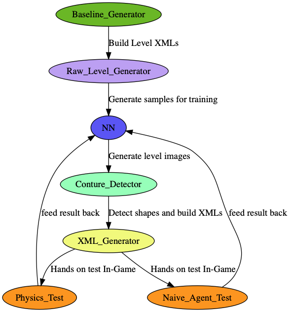

# AI Birds LevelGANerator

This repo contains all work done by Samet & Patrick for the bachelor projeckt SME-B: AI-Birds. 

The general approach is, to use generate new levels for the game "Angry Birds" based on the algorithm GAN, instead of a more precedual approach.

## Usage

Please use the tasks provided in `.vscode/tasks.json`

## Project Structure

`/nn` Contains relevant data for the GAN algorithm

`/baseline` holds the base line procedual level generator provided by the AI Birds competition

`/raw_level_builder` are the tools to generate images from the level XMLs

`/conture_detector` detecting the contures of the object (shapes) in the generated img of the nn

## Project Flow

