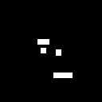
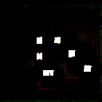

# Level GANerator

Creating levels based on a Generative Adversarial Network (GAN)

1. Creating samples of basic level in XML format
2. Create level images containing the basic shapes of all game objects

    

    Generated Images showing 'Pigs'

3. Feed the images in GAN.
4. Generate random levels from GAN 
   
   

   Generated Pigs from GAN
5. Detect all shapes of images and build new level XMLs from it
6. Test the new levels with the agent and feed the "good" ones back into the GAN

Authors:
 * Samet Akcabay
  * Patrick Haller

