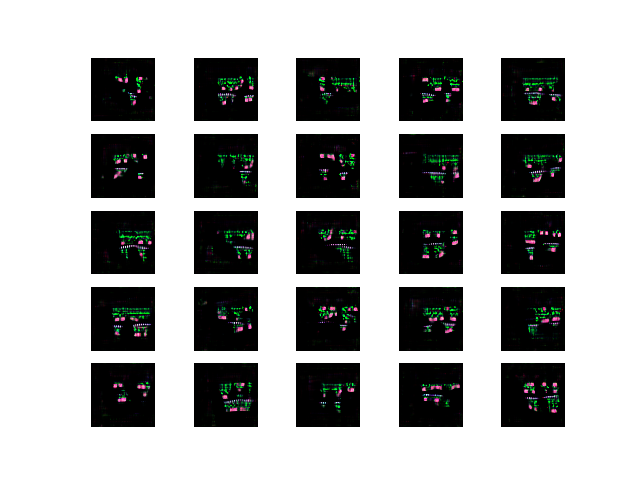

# Notes: Level Generator

## 14.Juni 2019

### Code reading and refactoring

1. The initial step is to understand the baseline project given
2. Personal refactoring helps by understanding and optimize speed and readability

### First ideas

To optimize or generate more optimal levels that are user friendly and intereseting
use a quantitative methods of evaluating randomly generated levels

Options:

1. Feed the now weighted levels in a neurel network
2. Use new weights in already used algorithm

### Sources

1. https://medium.com/datadriveninvestor/generating-human-faces-with-keras-3ccd54c17f16
2. https://github.com/platonovsimeon/dcgan-facegenerator/blob/master/face_generator.py

## 11. July 2019

After trying to generate images based on all objects of a game the image got very crowded.

The result of generated images with GAN do not look very promising. It appears that the shapes
can become very blurry.

Another approach is to divide the image processing process into different images, where the game objects are not inferring with each other.
